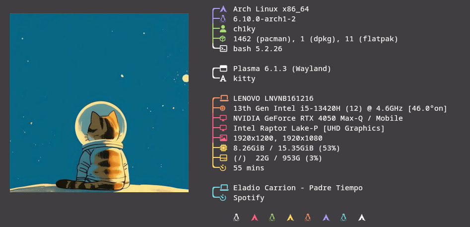

   


# Neofetch Configuration

This repository contains a custom configuration for Neofetch.

## Installing Neofetch

To install Neofetch, follow these instructions based on your operating system:

### On Debian/Ubuntu

Open a terminal and run these commands one by one:

```sh
sudo apt update
sudo apt install neofetch
```

### On Arch Linux

Open a terminal and run this command:

```sh
sudo pacman -S neofetch
```

### On Fedora

Open a terminal and run this command:

```sh
sudo dnf install neofetch
```

### On macOS (using Homebrew)

Open a terminal and run this command:

```sh
brew install neofetch
```

## Using This Configuration

To use this Neofetch configuration, follow these steps:

1. **Clone this repository:**

   Open a terminal and run:

   ```sh
   git clone https://github.com/CH1KY/Neofetch_config.git
   cd Neofetch_config
   ```

2. **Copy the configuration file:**

   Run this command in the terminal:

   ```sh
   mkdir -p ~/.config/neofetch
   cp config.conf ~/.config/neofetch/config.conf
   ```

   This creates a configuration directory for Neofetch and copies the custom configuration file into that directory.

## Changing the Image in the Configuration

To change the image displayed in Neofetch:

1. Open the `config.conf` file in a text editor (you can use `nano`, `vim`, `gedit`, or any other editor).

2. Find the line containing `image_source`.

3. Change the value of `image_source` to the path of your new image. For example:

   # Change this line to the path of your image
   image_source="/path/to/your/image.png"

## Adding a Background Image

To include a background image in this section of the `README.md`:

1. Upload the image to the repository.

2. Add the following line at the end of this file, replacing `background.png` with the name of your image file:

   

